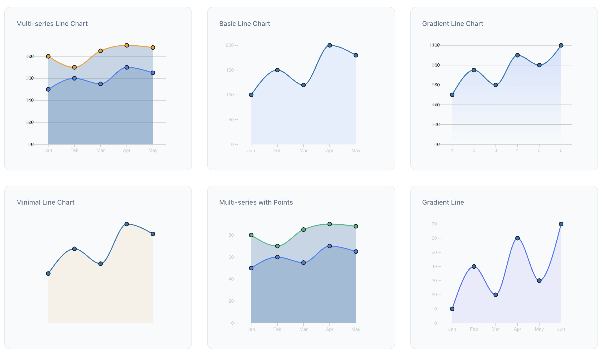
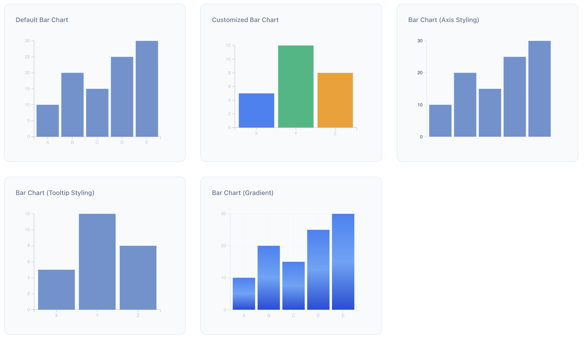
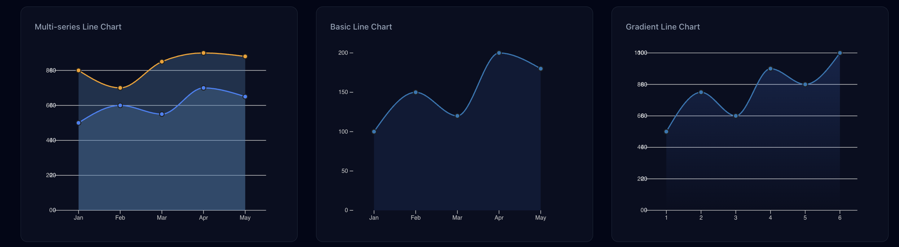

# Apus - React Chart Library

<div align="center">
  
</div>

A powerful and customizable chart library for React applications, built with D3.js and TypeScript.

## Features

- 🎯 Built with React 18 and TypeScript
- 📊 Powered by D3.js for powerful data visualization
- 🎨 Customizable and responsive charts
- 📦 Lightweight and easy to integrate
- 🔍 Type-safe with TypeScript support
- 🎨 Modern UI components with Tailwind CSS

## Screenshots


*Interactive Line Chart with Multiple Datasets*


*Customizable Bar Chart with Tooltips*


*Advanced Scatter Plot with Regression Line*

## Installation

```bash
npm install apus
# or
yarn add apus
# or
pnpm add apus
```

## Peer Dependencies

This library requires the following peer dependencies:

```json
{
  "d3": "^7.0.0",
  "react": "^18.0.0",
  "react-dom": "^18.0.0"
}
```


## Available Chart Types

### 1. Line Chart
```tsx
import { LineChart } from 'apus';

<LineChart
  data={data}
  width={600}
  height={400}
  xAxis={{ title: 'Time' }}
  yAxis={{ title: 'Value' }}
  curve="monotoneX"
/>
```

### 2. Bar Chart
```tsx
import { BarChart } from 'apus';

<BarChart
  data={data}
  width={600}
  height={400}
  orientation="vertical"
  padding={0.2}
/>
```

### 3. Scatter Plot
```tsx
import { ScatterPlot } from 'apus';

<ScatterPlot
  data={data}
  width={600}
  height={400}
  pointSize={5}
  pointColor="steelblue"
/>
```

## Configuration Options

### Common Props
All chart components accept these common props:

```typescript
interface ChartProps {
  data: Array<DataPoint>;
  width: number;
  height: number;
  margin?: {
    top: number;
    right: number;
    bottom: number;
    left: number;
  };
  theme?: 'light' | 'dark';
  responsive?: boolean;
}
```

### Axis Configuration
```typescript
interface AxisConfig {
  title?: string;
  tickFormat?: (value: number) => string;
  tickCount?: number;
  showGrid?: boolean;
  gridColor?: string;
}
```

### Animation Options
```typescript
interface AnimationConfig {
  duration?: number;
  easing?: 'linear' | 'ease' | 'ease-in' | 'ease-out' | 'ease-in-out';
  delay?: number;
}
```

## Advanced Usage Examples

### 1. Custom Styling
```tsx
<LineChart
  data={data}
  width={600}
  height={400}
  style={{
    lineColor: '#FF5733',
    lineWidth: 2,
    areaColor: 'rgba(255, 87, 51, 0.2)',
  }}
/>
```

### 2. Interactive Features
```tsx
<BarChart
  data={data}
  width={600}
  height={400}
  interactive={true}
  onBarClick={(data) => console.log('Clicked:', data)}
  tooltip={(data) => `Value: ${data.value}`}
/>
```

### 3. Multiple Datasets
```tsx
<LineChart
  datasets={[
    { data: dataset1, color: '#FF5733', label: 'Series 1' },
    { data: dataset2, color: '#33FF57', label: 'Series 2' },
  ]}
  width={600}
  height={400}
  legend={true}
/>
```

## API Documentation

### Chart Components

#### LineChart
```typescript
interface LineChartProps extends ChartProps {
  curve?: 'linear' | 'monotoneX' | 'monotoneY' | 'natural';
  showArea?: boolean;
  showPoints?: boolean;
  pointSize?: number;
}
```

#### BarChart
```typescript
interface BarChartProps extends ChartProps {
  orientation?: 'vertical' | 'horizontal';
  padding?: number;
  cornerRadius?: number;
}
```

#### ScatterPlot
```typescript
interface ScatterPlotProps extends ChartProps {
  pointSize?: number;
  pointColor?: string;
  showRegression?: boolean;
}
```

### Utility Functions

```typescript
// Format numbers with commas
formatNumber(value: number): string

// Generate color scales
createColorScale(domain: number[], range: string[]): (value: number) => string

// Calculate statistics
calculateStats(data: number[]): {
  mean: number;
  median: number;
  standardDeviation: number;
}
```

## Development

1. Clone the repository:
```bash
git clone https://github.com/harshattray/apus.git
cd apus
```

2. Install dependencies:
```bash
npm install
```

3. Start the development server:
```bash
npm run dev
```

4. Build the library:
```bash
npm run build
```

## Contributing

Contributions are welcome! Please feel free to submit a Pull Request. For major changes, please open an issue first to discuss what you would like to change.

## License

MIT © Harsha Attray

## Support

If you encounter any issues or have questions, please [open an issue](https://github.com/harshattray/apus/issues) on GitHub.

## Author

- GitHub: [@harshattray](https://github.com/harshattray)
- Medium: [@Harshattray](https://medium.com/@Harshattray)
